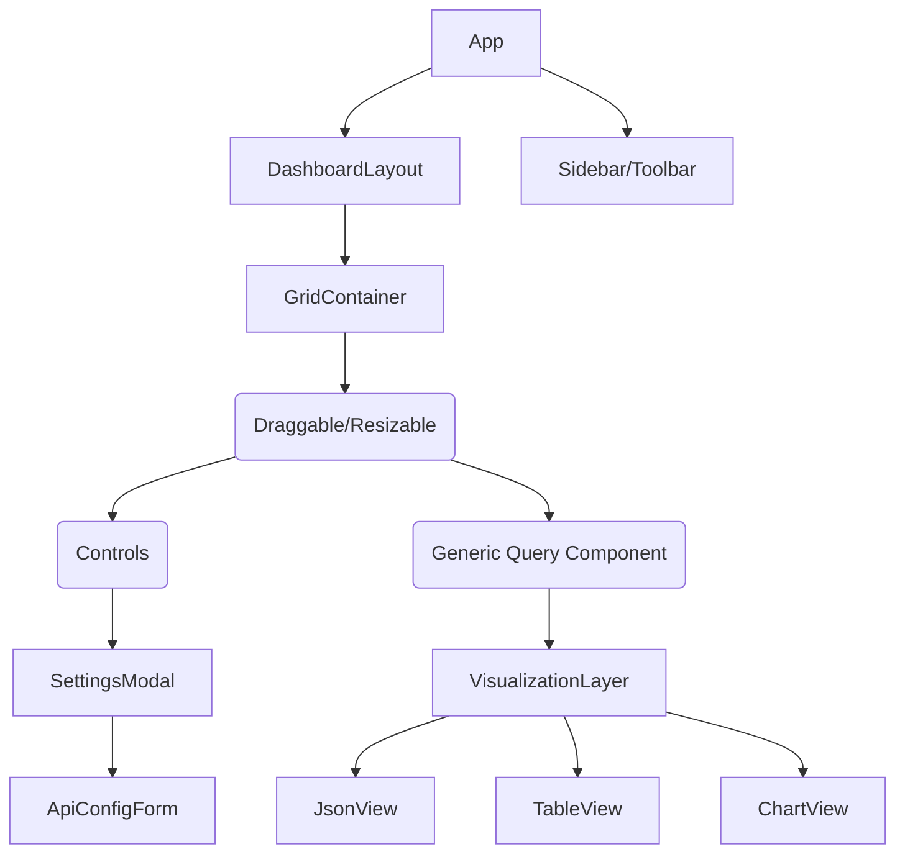

# 專案規格書：動態可自定義儀表板
# Project Specification: Dynamic Customizable Dashboard

## 1. 專案概述 (Project Overview)

**中文：**
本專案旨在建立一個高度靈活的 React 儀表板。使用者可以透過拖放 (Drag-and-Drop) 介面自由定義卡片 (Card) 的形狀與大小。核心功能包含動態資料串接，支援 RESTful API 與 GraphQL，並允許使用者設定全域 (Global) 或個別卡片 (Local) 的資料來源。

**English:**
This project aims to build a highly flexible React dashboard. Users can freely define the shape and size of cards via a Drag-and-Drop interface. The core functionality includes dynamic data integration, supporting both RESTful APIs and GraphQL, allowing users to configure data sources globally or on a per-card basis.

---

## 2. 技術棧 (Tech Stack)

| Category | Technology | Reasoning |
| :--- | :--- | :--- |
| **Framework** | **React (v18+) + TypeScript** | 確保型別安全與組件化開發 (Type safety and component-based architecture). |
| **Styling** | **Tailwind CSS** | 快速樣式開發與響應式設計 (Rapid styling and responsive design). |
| **Grid / Layout** | **react-grid-layout** | 處理複雜的拖拉、縮放與網格系統 (Handles complex dragging, resizing, and grid systems). |
| **State Management** | **Zustand** | 輕量且高效的狀態管理，用於儲存 Dashboard config (Lightweight state management for dashboard config). |
| **Data Fetching** | **TanStack Query (React Query)** | 管理 API 快取、Loading 狀態與重新抓取 (Manages API caching, loading states, and refetching). |
| **Forms** | **React Hook Form** | 處理 API Endpoint 輸入與設定驗證 (Handles API endpoint inputs and validation). |
| **Icons** | **Lucide React** | 現代化且輕量的 Icon 庫 (Modern and lightweight icon library). |

---

## 3. 核心功能設計 (Core Features Design)

### 3.1 佈局系統 (Layout System)
* **Grid System:** 使用 12 欄網格系統，讓使用者可以自由調整 Card 的寬度 (`w`) 和高度 (`h`)。
* **Interaction:** 支援拖曳 (`draggable`) 改變位置與縮放 (`resizable`) 改變大小。
* **Responsive:** 支援 RWD，在手機版自動切換為單欄模式。

### 3.2 資料來源配置 (Data Source Configuration)
系統需支援兩種層級的設定 (The system supports two levels of configuration):

1.  **Global Endpoint:**
    * 作為預設值 (Default)。
    * 例如：設定一個 Base URL，所有卡片預設繼承此設定。
2.  **Local Endpoint (Per Card):**
    * 每張卡片可以獨立設定 Override 全域設定。
    * 支援混合模式：Card A 使用 REST API，Card B 使用 GraphQL。

### 3.3 資料請求邏輯 (Data Fetching Logic)
* **RESTful:** 支援 GET/POST，Header 自定義 (如 Bearer Token)。
* **GraphQL:** 支援 Query string 與 Variables。
* **Generic Fetcher:** 建立一個通用的 Hook，根據傳入的設定自動決定使用 `fetch` (REST) 或 `graphql-request`。

---

## 4. 資料結構 (Data Structure)

### 4.1 身份驗證狀態 (Auth State)

```typescript
interface UserProfile {
  id: string;
  name: string;
  email: string;
  avatar?: string;
}

interface AuthState {
  isAuthenticated: boolean;
  token: string | null; // JWT / OAuth Access Token
  user: UserProfile | null;
  
  // Actions (Placeholder for future logic)
  login: (provider?: string) => Promise<void>;
  logout: () => void;
  setToken: (token: string) => void;
}
```

### 4.2 儀表板設定 (Dashboard Config)

這是整個應用程式最核心的 State 設計。
This is the core state design of the application.

```typescript
// 定義 API 的類型 (Define API types)
type ApiType = 'REST' | 'GRAPHQL';
type HttpMethod = 'GET' | 'POST';

// API 設定介面 (API Configuration Interface)
interface ApiConfig {
  endpoint: string;      // URL
  type: ApiType;
  method?: HttpMethod;   // Only for REST
  headers?: Record<string, string>; // Auth tokens, etc.
  body?: string;         // JSON body for REST or Query for GQL
  variables?: string;    // Variables for GraphQL
}

// 儀表板卡片介面 (Dashboard Widget Interface)
interface Widget {
  id: string;
  title: string;
  // Layout config for react-grid-layout
  layout: {
    i: string; // matches id
    x: number;
    y: number;
    w: number;
    h: number;
  };
  // Data Source Logic
  useGlobalEndpoint: boolean;
  localApiConfig?: ApiConfig;
  // View Configuration (How to render the data)
  viewType: 'JSON' | 'Chart' | 'Table';
  dataKey?: string; // Path to access data in response (e.g., "data.users")
}

// 全域狀態 (Global Store State)
interface DashboardState {
  isEditable: boolean; // Toggle edit mode
  globalApiConfig: ApiConfig;
  widgets: Widget[];
  // Actions
  addWidget: (widget: Widget) => void;
  updateWidget: (id: string, updates: Partial<Widget>) => void;
  removeWidget: (id: string) => void;
  updateLayout: (layout: Layout[]) => void;
}
```

---

## 5. 使用者流程 (User Flow)

### Step 1: 初始化 (Initialization)
* 使用者進入 Dashboard。
* (Optional) 設定全域 API Endpoint (例如公司內部的 Gateway)。

### Step 2: 建立卡片 (Create Widget)
* 使用者點擊 "Add Widget"。
* 一張預設大小的卡片出現在網格中。

### Step 3: 定義形狀 (Define Shape)
* 使用者拖曳卡片右下角調整大小 (Resize)。
* 使用者拖曳卡片頂部移動位置 (Move)。

### Step 4: 設定資料 (Configure Data)
* 使用者點擊卡片上的 "Edit" 按鈕。
* 彈出設定 Modal：
    * **Source:** 勾選 "Use Global" 或輸入新的 Endpoint。
    * **Type:** 選擇 REST 或 GraphQL。
    * **Payload:** 輸入 Query 或 JSON Body。
    * **Response View:** 選擇如何顯示 (Raw JSON, Table, etc.)。

### Step 5: 檢視結果 (View Result)
* 卡片根據設定 fetch 資料並渲染。
* 使用者可以鎖定 Dashboard (Disable editing) 進行純瀏覽。

---

## 6. 元件架構設計 (Component Architecture)



### 關鍵元件說明 (Key Components)

1.  **`GridContainer`**: 包裝 `react-grid-layout`，負責處理 Layout 變更事件。
2.  **`DataFetcher`**: 這是一個 Smart Component。它接收 `ApiConfig` 作為 props，使用 React Query 發送請求，並處理 Loading/Error 狀態。
3.  **`ApiConfigForm`**: 一個複雜的 Form，根據使用者選擇 REST 或 GraphQL 動態切換顯示的欄位 (Body vs Query)。

---

## 7. 擴充性考量 (Scalability)

* **Plugin System for Views:** 目前支援 JSON/Table，未來可以輕鬆加入 Recharts 或 Chart.js 來支援圖表，只需在 `VisualizationLayer` 擴充 switch case。
* **Authentication:** 可以在 `GlobalApiConfig` 中加入 Bearer Token 的設定，讓所有卡片自動帶入權限 Header。