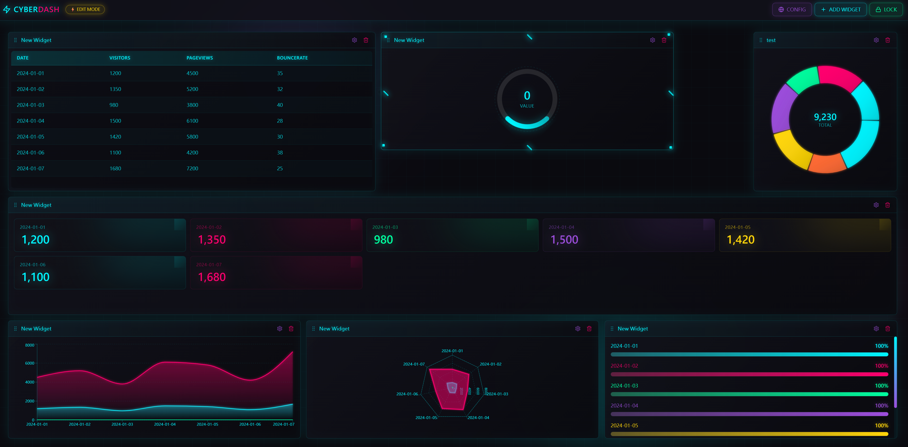

# 動態可自定義儀表板

<p align="center">
  
  
  
  
</p>

一個高度靈活、賽博龐克風格的 React 儀表板，支援拖放介面。使用者可以自由定義小工具的形狀、大小，並配置多種資料來源，同時支援 RESTful API 和 GraphQL。

> 📖 [English Documentation](./README.md)

---

## ✨ 功能特色

- 🎨 **賽博龐克 UI 主題** - 霓虹發光效果、動態漸層、未來感設計
- 📐 **拖放式佈局** - 可從所有邊緣/角落自由調整大小和位置
- 🔌 **彈性資料來源** - 支援 REST API 和 GraphQL，可設定全域/區域配置
- 📊 **多種視覺化圖表** - 長條圖、折線圖、甜甜圈圖、雷達圖、儀表板、進度條、統計卡片、表格和 JSON 檢視
- 💾 **持久化狀態** - 儀表板配置自動儲存至 localStorage
- 🎯 **Demo 資料模式** - 內建範例資料集，無需 API 即可測試
- 📱 **響應式設計** - 適應不同螢幕尺寸
- ⚡ **流暢動畫** - 使用 Framer Motion 和 React Spring

---

## 🚀 快速開始



### 系統需求

- Node.js 18+
- npm 或 yarn

### 安裝

```bash
# 複製專案
git clone <repository-url>
cd Dyanmic_Customize_Dashboard

# 安裝依賴
npm install

# 啟動開發伺服器
npm run dev
```

### 建置生產版本

```bash
npm run build
npm run preview
```

### 執行測試

```bash
npm run test
```

---

## 🛠️ 技術棧

| 類別 | 技術 | 用途 |
| :--- | :--- | :--- |
| **框架** | React 18 + TypeScript | 型別安全與組件化開發 |
| **建置工具** | Vite | 快速開發與優化建置 |
| **樣式** | Tailwind CSS | 使用工具類別快速開發樣式 |
| **網格佈局** | react-grid-layout | 拖曳、縮放與網格管理 |
| **狀態管理** | Zustand | 輕量狀態管理與持久化 |
| **資料獲取** | TanStack Query | API 快取、載入狀態、重新獲取 |
| **表單** | React Hook Form | 表單處理與驗證 |
| **圖表** | Recharts | 資料視覺化組件 |
| **動畫** | Framer Motion + React Spring | 流暢 UI 動畫 |
| **圖示** | Lucide React | 現代圖示庫 |
| **測試** | Vitest + Testing Library | 單元測試與組件測試 |

---

## 📊 視覺化類型

| 類型 | 說明 |
| :--- | :--- |
| **長條圖 (Bar Chart)** | 垂直長條視覺化，帶有漸層填充 |
| **折線圖 (Line Chart)** | 面積/折線圖，帶有發光效果 |
| **甜甜圈圖 (Donut Chart)** | 圓形圖表，帶有動畫區段 |
| **雷達圖 (Radar Chart)** | 多軸雷達視覺化 |
| **儀表板 (Gauge)** | 圓形儀表，帶有動畫數值 |
| **進度條 (Progress)** | 進度條，帶有掃描效果 |
| **統計卡片 (Stats)** | 響應式統計卡片網格，帶有滾動數字 |
| **表格 (Table)** | 賽博龐克風格資料表格 |
| **JSON** | 原始 JSON 檢視器，帶有語法高亮 |

---

## 🏗️ 專案結構

```
src/
├── components/
│   ├── charts/           # 賽博龐克圖表組件
│   │   ├── CyberBarChart.tsx
│   │   ├── CyberLineChart.tsx
│   │   ├── CyberDonutChart.tsx
│   │   ├── CyberRadarChart.tsx
│   │   ├── CyberGaugeChart.tsx
│   │   ├── CyberProgressBar.tsx
│   │   └── CyberStatCard.tsx
│   ├── grid/             # 網格佈局容器
│   ├── layout/           # 儀表板佈局與工具列
│   ├── visualization/    # 視圖層組件
│   └── widget/           # 小工具包裝器與配置
├── data/                 # Demo 資料定義
├── hooks/                # 自定義 React hooks
├── store/                # Zustand store
├── types/                # TypeScript 型別定義
└── App.tsx               # 主應用程式組件
```

---

## 📋 核心資料模型

### API 配置

```typescript
interface ApiConfig {
  endpoint: string;
  type: 'REST' | 'GRAPHQL';
  method?: 'GET' | 'POST';
  headers?: Record<string, string>;
  body?: string;
  variables?: string;
  useDefaultData?: boolean;
  defaultDataKey?: string;
}
```

### 小工具配置

```typescript
interface Widget {
  id: string;
  title: string;
  layout: {
    i: string;
    x: number;
    y: number;
    w: number;
    h: number;
  };
  useGlobalEndpoint: boolean;
  localApiConfig?: ApiConfig;
  viewType: 'JSON' | 'Table' | 'Chart' | 'BarChart' | 'LineChart' | 
            'DonutChart' | 'RadarChart' | 'Gauge' | 'Progress' | 'Stats';
  dataKey?: string;
}
```

---

## 🎮 使用指南

### 1. 啟用編輯模式
點擊工具列中的 **「Edit Mode」** 切換按鈕以啟用小工具操作。

### 2. 新增小工具
點擊 **「+ Add Widget」** 在儀表板上建立新的小工具。

### 3. 調整小工具大小
將滑鼠懸停在小工具的任何邊緣或角落，即可看到調整大小的把手。拖曳即可調整大小。

### 4. 移動小工具
拖曳小工具的標題列即可在網格上重新定位。

### 5. 配置小工具
點擊小工具上的 **齒輪圖示** 開啟配置彈窗：
- 設定小工具標題
- 選擇全域或區域資料來源
- 配置 API 端點（REST/GraphQL）
- 選擇視覺化類型

### 6. 全域 API 配置
點擊工具列中的 **「Global API」** 為所有小工具設定預設 API 配置。

### 7. 使用 Demo 資料
在全域 API 配置中，啟用 **「Use Demo Data」** 即可在沒有真實 API 的情況下測試視覺化效果。

---

## 🎨 Demo 資料集

| 資料集 | 說明 | 最佳視覺化 |
| :--- | :--- | :--- |
| 銷售資料 (Sales Data) | 月度銷售數據 | 長條圖、折線圖 |
| 流量資料 (Traffic Data) | 網站訪客指標 | 折線圖、統計卡片 |
| 類別分佈 (Category Distribution) | 類別百分比 | 甜甜圈圖 |
| 技能雷達 (Skills Radar) | 技能熟練度 | 雷達圖 |
| 專案進度 (Project Progress) | 專案完成狀態 | 進度條 |
| 系統指標 (System Metrics) | 系統效能資料 | 儀表板、統計卡片 |
| 即時指標 (Live Metrics) | 即時風格指標 | 統計卡片網格 |
| 使用者 (Users) | 使用者資料 | 表格 |
| 指標 (Metrics) | 關鍵績效指標 | 統計卡片、JSON |

---

## 🔧 配置

### 環境變數

建立 `.env` 檔案進行自定義配置：

```env
VITE_API_BASE_URL=https://api.example.com
```

### Tailwind 主題

賽博龐克配色定義在 `tailwind.config.js`：

```javascript
colors: {
  'cyber-cyan': '#00f5ff',
  'cyber-pink': '#ff006e',
  'cyber-purple': '#9d4edd',
  'cyber-green': '#00ff9f',
  'cyber-yellow': '#ffd60a',
  'cyber-dark': '#0a0a0f',
}
```

---

## 📝 授權

MIT License

---

## 🤝 貢獻

歡迎貢獻！請隨時提交 Pull Request。

1. Fork 此專案
2. 建立您的功能分支 (`git checkout -b feature/AmazingFeature`)
3. 提交您的變更 (`git commit -m 'Add some AmazingFeature'`)
4. 推送到分支 (`git push origin feature/AmazingFeature`)
5. 開啟 Pull Request
